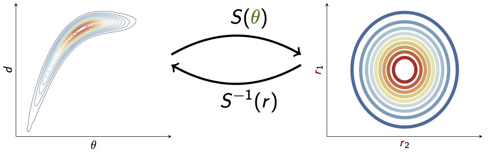

.. MParT documentation master file, created by
   sphinx-quickstart on Tue Jan 11 08:36:32 2022.
   You can adapt this file completely to your liking, but it should at least
   contain the root `toctree` directive.

.. module:: mpart

MParT: Monotone Parameterization Toolkit
========================================
:mod:`mpart` is a multi-language toolkit for constructing and using monotone functions for measure transport and regression.

Contents 
-------------

.. toctree::
   :maxdepth: 1

   source/installation
   source/getting_started
   source/tutorials/index
   source/mathematics
   source/api/index
   source/development/index

Citing 
-------------

When citing MParT, we recommend citing both MParT as a whole and any original research articles for the specific algorithms
used by MParT in your problem.  Refer to MParT's documentation for the relevant algorithmic  references.  The general MParT
reference is 

.. epigraph::

   MParT Development Team. <YEAR>. Monotone Parameterization Toolkit (MParT), <VERSION>. https://measuretransport.github.io/MParT/

In bibtex, this is::

   @misc{mpart2022,
      title = {{Monotone Parameterization Toolbkit (MParT)}},
      author = {{MParT Development Team}},
      note = {Version 1.0.0},
      year = {2022},
      url = {https://measuretransport.github.io/MParT/},
   }

License
---------

MParT is release under the BSD license.

.. epigraph::

    BSD 3-Clause License

    Copyright (c) 2022, Massachusetts Institute of Technology
    All rights reserved.

    Redistribution and use in source and binary forms, with or without modification, are permitted provided that the following conditions are met:

    1. Redistributions of source code must retain the above copyright notice, this list of conditions and the following disclaimer.

    2. Redistributions in binary form must reproduce the above copyright notice, this list of conditions and the following disclaimer in the documentation and/or other materials provided with the distribution.

    3. Neither the name of the copyright holder nor the names of its contributors may be used to endorse or promote products derived from this software without specific prior written permission.

    THIS SOFTWARE IS PROVIDED BY THE COPYRIGHT HOLDERS AND CONTRIBUTORS "AS IS" AND ANY EXPRESS OR IMPLIED WARRANTIES, INCLUDING, BUT NOT LIMITED TO, THE IMPLIED WARRANTIES OF MERCHANTABILITY AND FITNESS FOR A PARTICULAR PURPOSE ARE DISCLAIMED. IN NO EVENT SHALL THE COPYRIGHT HOLDER OR CONTRIBUTORS BE LIABLE FOR ANY DIRECT, INDIRECT, INCIDENTAL, SPECIAL, EXEMPLARY, OR CONSEQUENTIAL DAMAGES (INCLUDING, BUT NOT LIMITED TO, PROCUREMENT OF SUBSTITUTE GOODS OR SERVICES; LOSS OF USE, DATA, OR PROFITS; OR BUSINESS INTERRUPTION) HOWEVER CAUSED AND ON ANY THEORY OF LIABILITY, WHETHER IN CONTRACT, STRICT LIABILITY, OR TORT (INCLUDING NEGLIGENCE OR OTHERWISE) ARISING IN ANY WAY OUT OF THE USE OF THIS SOFTWARE, EVEN IF ADVISED OF THE POSSIBILITY OF SUCH DAMAGE.
