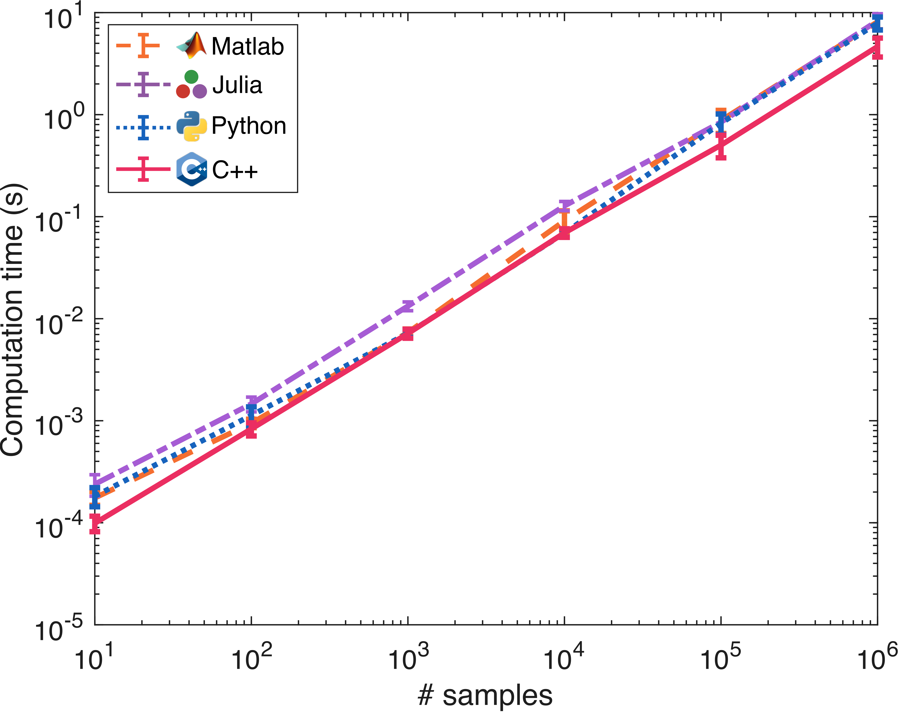

# Summary

Measure transport is a rich area in applied mathematics that involves the construction of deterministic transformations--known as transport maps--between probability distributions [@santambrogio2015optimal]. These maps characterize a complex target distribution as a (deterministic) transformation of a simple reference distribution (e.g., a standard Gaussian). In the context of probabilistic modeling, transport maps enable easy generation of samples from the target distribution and direct evaluation of the target probability density function. Monotone triangular maps [@baptista2022adaptive] are a specific class of transport maps endowed with several computational advantages over non-triangular maps, such as easy invertibility and training, and yet sufficiently general to represent any absolutely continuous distribution; they are also the building block of many normalizing flow architectures commonly used in the machine learning community [@papamakarios2021normalizing].

Triangular maps are also well suited to many tasks in Bayesian inference, including the modeling of conditional distributions [@Marzouk2016,@spantini2018inference] and the acceleration of posterior sampling [@el2012bayesian; @bigoni2016adaptive; @parno2018transport; @cotter2019ensemble].  The fundamental idea is to convert the problem of characterizing a probability distribution through Monte Carlo sampling, variational inference, or density estimation into an optimization problem over multivariate monotone functions. The efficient solution of this optimization problem is especially important when using maps as part of online algorithms, as commonly encountered in sequential inference [@spantini2019coupling].

In practice, working with triangular maps requires the definition of a parametric family of multivariate monotone functions.  The Monotone Parameterization Toolkit (`MParT`), pronounced aims to provide performance-portable implementations of such parameterizations.  `MParT` is a C++ library with bindings to Python, Julia, and Matlab that emphasizes fast execution and parsimonious parameterizations that can enable near real-time computation on low- and moderate-dimensional problems.

# Statement of need 
Several existing software packages have the ability to parameterize monotone functions, including TensorFlow Probability [@dillon2017tensorflow], TransportMaps [@transportmaps], ATM [@atm], and MUQ [@parno2021muq].  TensorFlow probability has a bijection class that allows deep neural network-based functions, such as normalizing flows [@papamakarios2021normalizing] to be easily defined and trained while also leveraging GPU computing resources if available but is focused on deep neural network parameterizations best suited for high dimensional problems.   The TransportMaps, ATM, and MUQ packages use an alternative parameterization based on rectified polynomial expansions that is more compact and easier to train on low to moderate dimensional problems.  At the core of these packages are scalar-valued functions $T_d : \mathbb{R}^d \rightarrow \mathbb{R}$ of the form 

\begin{equation}
T_d(\mathbf{x}_{1:d}; \mathbf{w}) = f(x_1,\ldots, x_{d-1},0; \mathbf{w}) + \int_0^{x_d} g( \partial_d f(x_1,\ldots, x_{d-1},t; \mathbf{w}) ) \, dt,
\label{eq:rectified}
\end{equation}

where $f(\mathbf{x}_{1:d}; \mathbf{w})$ is a general (non-monotone) function parameterized by coefficients $\mathbf{w}$ and $g:\mathbb{R}\rightarrow\mathbb{R}^+$ is a smooth positive function.  Typically $f$ takes the form of a multivariate polynomial expansion.  The efficient implementation of \autoref{eq:rectified} is non-trivial as it requires the coordination of numerical quadrature, polynomial evaluations, and gradient computations with respect to both the input $\mathbf{x}$ and the parameters $\mathbf{w}$. But the associated optimization problem has many desirable features, such as the absence of spurious local minima [@baptista2022adaptive], which enable efficient and reliable map training.

`MParT` aims to provide a performance portable shared-memory implementation of parameterizations built on \autoref{eq:rectified}.  `MParT` uses Kokkos [@edwards2014kokkos] to leverage multithreading on either CPUs or GPUs with a common code base.  `MParT` provides an efficient low-level library that can then be used to accelerate higher level packages like TransportMaps, ATM, and MUQ that cannot currently leverage GPU resources.  Bindings to Python, Julia, and Matlab are also provided to enable a wide variety of users to leverage the fast C++ core from the language of their choice.

# Performance and scalability 

The following plots show the performance of MParT for the evaluation of a rectified degree-$5$ polynomial transport map on $\mathbb{R}^5$, using different languages and Kokkos backends. The monotone parameterization is constructed from Hermite polynomials and an adaptive Simpson quadrature rule.  Random map coefficients and sample locations are used in this test.  At each sample level, the map is evaluated at fifty randomly selected coefficients.

The results show similar performance across languages (each using OpenMP backend with 8 threads) and nearly identical performance between the Threads and OpenMP backends.   For the evaluation of $10^6$ samples, the OpenMP backend with 16 threads is approximately $14\times$ faster than the serial backend.  The CUDA backend is approximately $82\times$ faster than the serial backend, or $6\times$ faster than the OpenMP backend.   Tests were performed in a Kubernetes container using 8 cores of a Intel(R) Xeon(R) Gold 6248 CPU and a Tesla V100-SXM2 GPU with CUDA version 11.2.

# Acknowledgements

We acknowledge support from the US Office of Naval Research under MURI Grant N00014-20-1-2595, the US Department of Energy under grant DE‐SC0021226, the Deutsche Forschungsgemeinschaft (DFG, German Research Foundation) – Projektnummern 459970814; 459970841, and computing resources from Dartmouth College and the Massachusetts Institute of Technology.

# References
